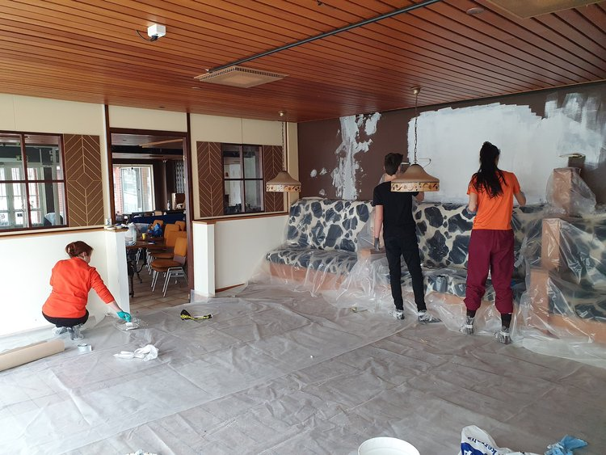

---
# Feel free to add content and custom Front Matter to this file.
# To modify the layout, see https://jekyllrb.com/docs/themes/#overriding-theme-defaults

layout: home
---

# First-ever Ukrainian House in Finland 1

We are eager to share the Ukrainian culture with Finland. With this in mind, we’ve decided to establish a one-of-a-kind **Ukraina Talo** in Tampere.

With the help of volunteers, relocated Ukrainians, local companies, and the city government we are opening a space where Finns and Ukrainians can share each other’s culture, learn, relax and simply feel at home.

Ukraina Talo will feature a daycare, a library, a classroom, and an open space with various activities. While we focus our Ukraina Talo efforts on helping relocated Ukrainians - our doos are open to everyone.

# First-ever Ukrainian House in Finland 2

We are eager to share the Ukrainian culture with Finland. With this in mind, we’ve decided to establish a one-of-a-kind **Ukraina Talo** in Tampere.

With the help of volunteers, relocated Ukrainians, local companies, and the city government we are opening a space where Finns and Ukrainians can share each other’s culture, learn, relax and simply feel at home.

Ukraina Talo will feature a daycare, a library, a classroom, and an open space with various activities. While we focus our Ukraina Talo efforts on helping relocated Ukrainians - our doos are open to everyone.

# First-ever Ukrainian House in Finland 3

We are eager to share the Ukrainian culture with Finland. With this in mind, we’ve decided to establish a one-of-a-kind **Ukraina Talo** in Tampere.

With the help of volunteers, relocated Ukrainians, local companies, and the city government we are opening a space where Finns and Ukrainians can share each other’s culture, learn, relax and simply feel at home.

Ukraina Talo will feature a daycare, a library, a classroom, and an open space with various activities. While we focus our Ukraina Talo efforts on helping relocated Ukrainians - our doos are open to everyone.

# First-ever Ukrainian House in Finland 4

We are eager to share the Ukrainian culture with Finland. With this in mind, we’ve decided to establish a one-of-a-kind **Ukraina Talo** in Tampere.

With the help of volunteers, relocated Ukrainians, local companies, and the city government we are opening a space where Finns and Ukrainians can share each other’s culture, learn, relax and simply feel at home.

Ukraina Talo will feature a daycare, a library, a classroom, and an open space with various activities. While we focus our Ukraina Talo efforts on helping relocated Ukrainians - our doos are open to everyone.

# First-ever Ukrainian House in Finland 5

We are eager to share the Ukrainian culture with Finland. With this in mind, we’ve decided to establish a one-of-a-kind **Ukraina Talo** in Tampere.

With the help of volunteers, relocated Ukrainians, local companies, and the city government we are opening a space where Finns and Ukrainians can share each other’s culture, learn, relax and simply feel at home.

Ukraina Talo will feature a daycare, a library, a classroom, and an open space with various activities. While we focus our Ukraina Talo efforts on helping relocated Ukrainians - our doos are open to everyone.

# First-ever Ukrainian House in Finland 6

We are eager to share the Ukrainian culture with Finland. With this in mind, we’ve decided to establish a one-of-a-kind **Ukraina Talo** in Tampere.

With the help of volunteers, relocated Ukrainians, local companies, and the city government we are opening a space where Finns and Ukrainians can share each other’s culture, learn, relax and simply feel at home.

Ukraina Talo will feature a daycare, a library, a classroom, and an open space with various activities. While we focus our Ukraina Talo efforts on helping relocated Ukrainians - our doos are open to everyone.
